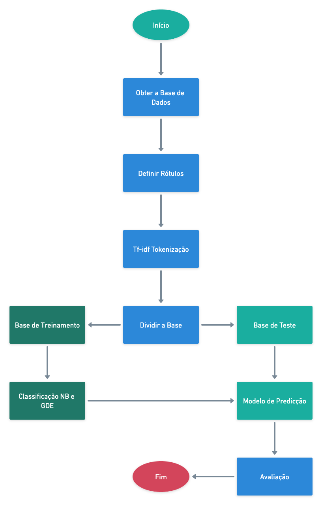

# Classificação de Textos - Comparação entre o algoritmo probabilístico Naive Bayes e o Gradiente Descendente Estocástico

A classificação de texto pertence ao conjunto de técnicas da aérea de Aprendizado de Máquina. Essa área é útil para interpretar a linguagem natural de seres humanos. Essa possibilidade da uma máquina conseguir comunicar com humanos abre grandes possibilidades de aplicações em diversas áreas e pode solucionar problemas complexos do cotidiano, exemplos disso estão em diversas áreas, como implementações de chatbots para marketing, financeiro, redes sociais e entre outras. Nesse contexto, é interessante realizar comparações entre os dois métodos consolidados de aprendizado de máquina supervisionado, para analisar qual o melhor método que podemos utilizar em determinado caso prático. Assim, este projeto apresenta uma comparação entre os algoritmos Naive Bayes (NB) e Gradiente Descendente Estocástico (GDE). Os dois algoritmos são comumente utilizados para classificações de texto e utilizados em solucionar problemas de Aprendizado de Máquina. A implementação considera o uso da linguagem Python e o uso do framework de código aberto sklearn, para contemplar tarefas de tratamento de dados, aplicação dos algoritmos, extração de métricas e testes com uma base de dados na língua Portuguesa.

&nbsp;

## DataSet

O DataSet utilizado está disponível no [link](https://www.kaggle.com/marlesson/news-of-the-site-folhauol), com a licença de domínio público, possuindo uma coleção de artigos do jornal da folha de São Paulo, entre os períodos de Janeiro de 2015 e Setembro de 2017.


# Visão Geral do Programa

A implementação foi dívida em dois programas diferentes escrito em **Python versão 3.6.9**. A primeira implementação, que é chamada de “createDataset.py”, abre o arquivo de dados “articles.csv”, junta o texto do título e a notícia em uma coluna, mantêm o rótulo, separa 25% dos dados de testes e 75%. A imagem abaixo descreve o processo geral da execução do projeto.

&nbsp;




# Passos para Execução do Projeto

1) Realizar o clone do projeto no terminal:

	```
	git clone https://github.com/joelravelli/ai-text-classification.git
	```

2) Acesso o diretório:
	```
	cd ai-text-classification
	```

3) Faça o download do DataSet no link já especificado e extraia o arquivo dentro do diretório do projeto.


4) Instale as dependências Python 3
	```
	pip install -r requirements.txt
	```

5) Crie o as bases de treinamento e testes
	```
	./createDataset.py
	```

6) Execute o programa e obtenha as métricas / resultados
	```
	dataAnalises.py
	```
  
